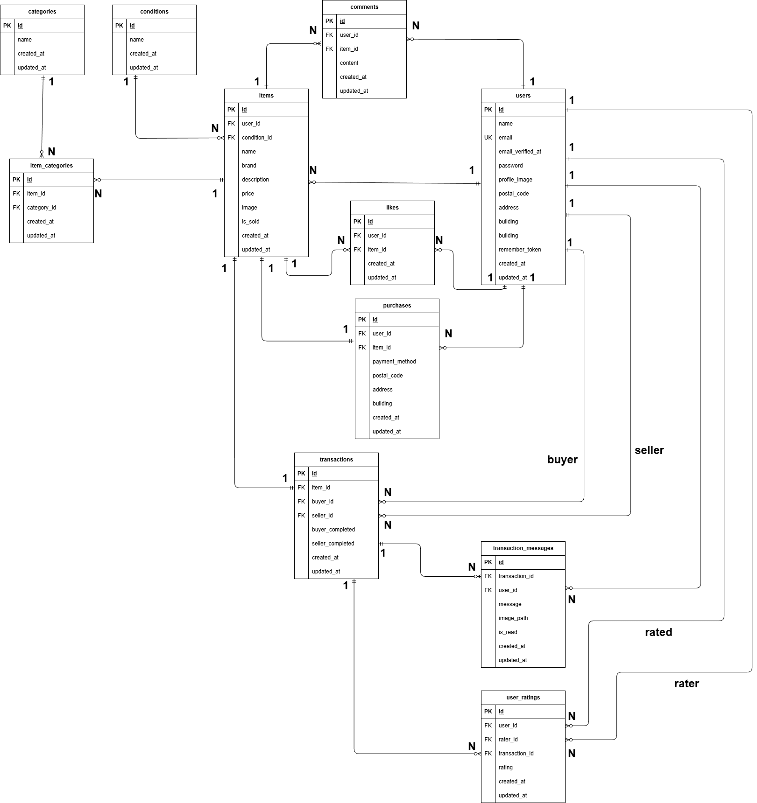

# COACHTECH フリマ

COACHTECHが開発した独自のフリマアプリケーション。  
商品の出品、購入、いいね、コメント、取引チャット、評価機能を備えたフリマサービス。

## 更新履歴
- **2026/01/31**: 取引チャット・評価機能を追加
  - 取引メッセージ送信・編集・削除機能
  - 取引完了・評価機能（購入者・出品者）
  - メール通知機能
  - ER図更新（transactions, transaction_messages, user_ratingsテーブル追加）
  - テストアカウント変更（seller1, seller2, buyer）

---

## 環境構築

### Dockerビルド
```bash
git clone https://github.com/Kumicho-naka/coachtech-flea-market.git
cd coachtech-flea-market
docker-compose up -d --build
```

### Laravel環境構築
```bash
docker-compose exec php bash
composer install
cp .env.example .env
php artisan key:generate
php artisan storage:link
php artisan migrate
php artisan db:seed
```

### .env設定（重要）

`.env`ファイルの以下の項目を設定してください：

#### Stripe設定（決済機能に必須）
```env
STRIPE_KEY=pk_test_xxxxx
STRIPE_SECRET=sk_test_xxxxx
```

> **Stripeのテストキー取得方法**:
> 1. https://dashboard.stripe.com/register でアカウント作成（無料）
> 2. 「開発者」→「APIキー」からテストモードのキーをコピー
> 3. `.env`の`STRIPE_KEY`と`STRIPE_SECRET`に貼り付け

#### Mailtrap設定（メール認証機能を使用する場合）
```env
MAIL_USERNAME=your_mailtrap_username
MAIL_PASSWORD=your_mailtrap_password
```

> **Mailtrapの設定方法**:
> 1. https://mailtrap.io/ でアカウント作成（無料）
> 2. Inboxを作成
> 3. 「SMTP Settings」から認証情報をコピー
> 4. `.env`に貼り付け

設定後、キャッシュをクリア：
```bash
php artisan config:clear
```

---

## 使用技術（実行環境）
- PHP 8.1.33
- Laravel 8.83.29
- MySQL 8.0.26
- nginx 1.21.1
- Docker

**認証**
- Laravel Fortify 1.19.1

**決済**
- Stripe API (stripe-php 18.0.0)

**メール送信**
- Mailtrap

---

## ER図


> **2026/01/31更新**: transactions, transaction_messages, user_ratingsテーブルを追加

---

## URL
- 開発環境：http://localhost/
- phpMyAdmin：http://localhost:8080/

---

## アカウント情報

テスト用アカウント（3つ作成されます）:

| 役割 | メールアドレス | パスワード | 出品商品 |
|---|---|---|---|
| 出品者1 | seller1@example.com | password | C001～C005（腕時計、HDD、玉ねぎ、革靴、ノートPC） |
| 出品者2 | seller2@example.com | password | C006～C010（マイク、バッグ、タンブラー、コーヒーミル、メイク） |
| 購入者 | buyer@example.com | password | 商品なし（購入・取引用） |

> **2026/01/31更新**:機能追加に伴い、テスト用アカウント情報を変更。

**取引テスト用:**
- 購入者（buyer@example.com）が出品者1の商品2つを購入済み
- 取引チャット機能のテストが可能

---

## 機能確認

### 基本機能
1. **会員登録**: http://localhost/register
2. **ログイン**: http://localhost/login
3. **商品一覧**: http://localhost/
4. **商品検索**: ヘッダーの検索ボックスで「マイク」など検索
5. **商品出品**: ログイン後、「出品」ボタンから出品

### 決済機能（Stripe）
1. 商品詳細ページで「購入手続きへ」
2. 支払い方法で「カード支払い」を選択
3. Stripe決済画面でテストカード情報を入力:
   - カード番号: `4242 4242 4242 4242`
   - 有効期限: `12/34`
   - CVC: `123`
4. 決済完了後、商品一覧で「Sold」表示を確認

### コンビニ支払いのテスト（任意）
コンビニ支払いの完全な動作確認には、Stripe CLIが必要です:

```bash
# Stripe CLIでWebhookを転送
docker run --rm -it \
  -v ~/.config/stripe:/root/.config/stripe \
  stripe/stripe-cli:latest listen --forward-to host.docker.internal/webhook/stripe
```

出力された`whsec_xxxxx`を`.env`の`STRIPE_WEBHOOK_SECRET`に設定後、コンビニ支払いをテストできます。

> **注意**: Stripe CLIなしでもカード支払いで全機能の確認が可能です。

---

## テストの実行
```bash
php artisan test
```
### 取引チャット・評価機能
1. `buyer@example.com` / `password` でログイン
2. マイページ → 「取引中の商品」タブをクリック
3. 商品をクリックして取引チャット画面を表示
4. メッセージ送信、編集、削除機能をテスト
5. 「取引を完了する」ボタンをクリック
6. 評価モーダルで星を選択して送信
7. 出品者側: `seller1@example.com` でログイン → 評価を確認
8. メール確認: Mailtrap